## 构造函数

```
Image({
    Key key,
    @required this.image,
    this.semanticLabel,
    this.excludeFromSemantics = false,
    this.width,
    this.height,
    this.color,
    this.colorBlendMode,
    this.fit,
    this.alignment = Alignment.center,
    this.repeat = ImageRepeat.noRepeat,
    this.centerSlice,
    this.matchTextDirection = false,
    this.gaplessPlayback = false,
  })
```

## 参数解释

>* image: 类型为ImageProvider，抽象类，需要自己实现获取图片数据的操作

目前系统实现的有
ExactAssetImage, AssetImage, NetworkImage, FileImage, MemoryImage, 而Image类为了方便，提供了几种方便的写法：Image.asset(), Image.network()... 内部就是 new 了一个相关的对象而已

```
MaterialApp(
      home: new Scaffold(
        body: Image(
          image: NetworkImage(
              "http://up.enterdesk.com/edpic_source/db/f1/ec/dbf1ec353b17dce848676e2fdb7f9bb4.jpg"),
        ),
      ),
    )
```


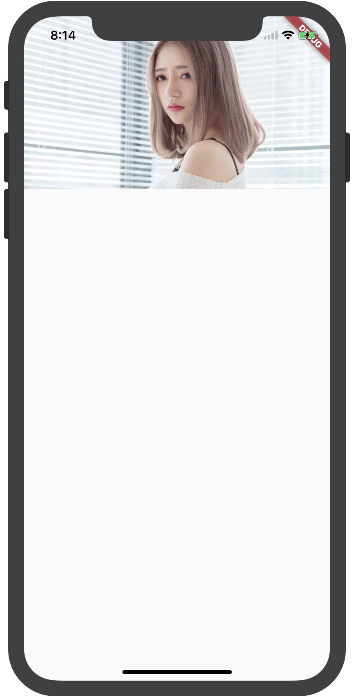

>* Width,Height

Image显示区域的宽度和高度设置，这里要把图片和Image两个东西区分开，图片本身有大小，Image这个Widget本身也有大小，而Image是个容器，想要达到想要的效果，除了设置width和height之外，还需要配合fit一起使用。fit主要作用：

|fit|Description|Result|
|-----|-----|-----|
|BoxFit.fill|全图显示，显示可能拉伸，充满|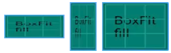|
|BoxFit.contain|全图显示，显示原比例，不需充满|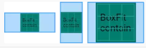|
|BoxFit.cover|显示可能拉伸，可能裁剪，充满|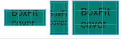|
|BoxFit.fitWidth|显示可能拉伸，可能裁剪，宽度充满|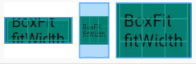|
|BoxFit.fitHeight|显示可能拉伸，可能裁剪，高度充满|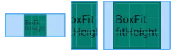|
|BoxFit.none|||
BoxFit.scaleDown|效果和contain差不多,但是此属性不允许显示超过源图片大小，可小不可大|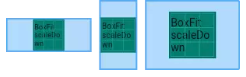|


>* color和colorBlendMode

color和colorBlendMode一般配合使用，BlendMode, 为混合模式的意思，包含如下诸多模式。和Android中Xfermode是一个原理。 各个属性作用如下，具体细节请参考这个链接

>* alignment:对齐方式，不用多讲

>* repeat

|repeat|Results|
|-----|-----|
|ImageRepeat.repeat|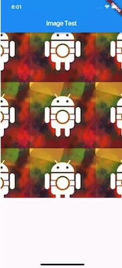|
|ImageRepeat.repeatX|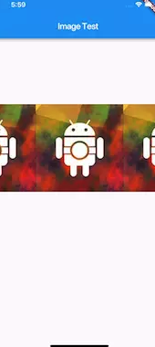|
|ImageRepeat.repeatY|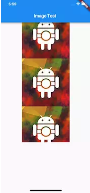|
|ImageRepeat.none|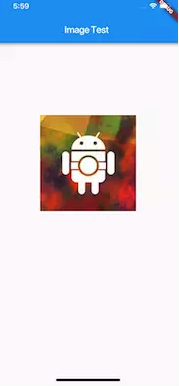|

>* centerSlice

当图片需要被拉伸显示的时候，centerSlice定义的矩形区域会被拉伸，就相当于android中的.9图片，我们定义一块区域，然后自动拉伸，当然，图片控件的显示大小必须大于图片本身才会有效果，不然会报错

```
Image image = new Image.asset(
      'imgs/logo.jpeg',
      width: 500.0,
      height: 500.0,
      fit: BoxFit.contain,
      centerSlice: new Rect.fromCircle(center: const Offset(100.0, 100.0), radius: 10.0 ),
    );
```

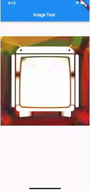

>* matchTextDirection

与Directionality配合使用

```
ListView(
          children: <Widget>[
            Directionality(
              textDirection: TextDirection.ltr,
              child: Image(
                image: NetworkImage(
                    "http://up.enterdesk.com/edpic_source/db/f1/ec/dbf1ec353b17dce848676e2fdb7f9bb4.jpg"),
                matchTextDirection: true,
              ),
            ),
            Directionality(
              textDirection: TextDirection.rtl,
              child: Image(
                image: NetworkImage(
                    "http://up.enterdesk.com/edpic_source/db/f1/ec/dbf1ec353b17dce848676e2fdb7f9bb4.jpg"),
                matchTextDirection: true,
              ),
            )
          ],
        )
```


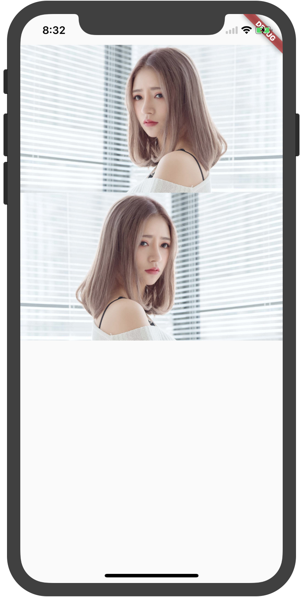

>* gaplessPlayback

当ImageProvider发生变化后，重新加载图片过程中，原图片的展示是否保留，true为保留，false为不保留，如果Image没有预设width和height，那Image控件size会变为0