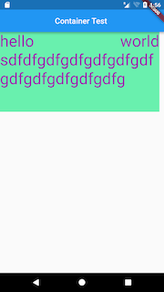
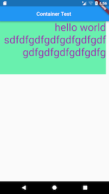
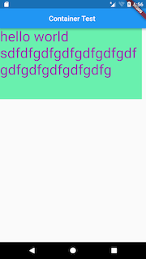
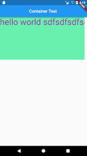
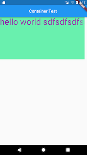
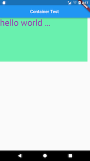
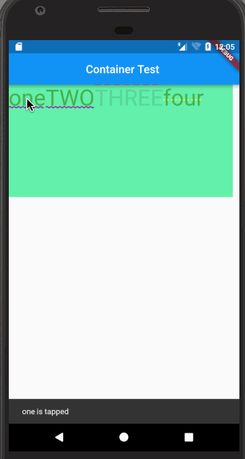

## 构造函数

```
Text(this.data, {
    Key key,
    this.style,
    this.textAlign,
    this.textDirection,
    this.locale,
    this.softWrap,
    this.overflow,
    this.textScaleFactor,
    this.maxLines,
    this.semanticsLabel,
  })
```

## 参数解释
>* style

TextStyle，用来定义Text中文字的各种属性。后面的例子会陆续使用到一些，常用的属性值也是相当好理解的。具体如下：

| 属性值 | 意义| 
| ----- | ----- | 
| inherit | 是否继承 |
| color |  字体颜色 |
| fontSize |  字体大小 |
| fontWeight | 字体厚度，也就是字体粗细 | 
| fontStyle | normal或者italic | 
| letterSpacing | 字母间隙(负值可以让字母更紧凑) | 
| wordSpacing | 单词间隙(负值可以让单词更紧凑) | 
| textBaseLine | 文本绘制基线(alphabetic/ideographic) | 
| height | 高度 |  | locale | 区域设置 | 
| decoration | 文字装饰(none/underline/overline/lineThrough) | 
| decorationColor | 文字装饰的颜色 | 
| decorationStyle | 文字装饰的风格(solid/double/dotted/dashed/wavy) | 
| fontFamily | 字体 | 

>* textAlign

文本对齐方式

|textAlign | Result |
| ----- | ----- | 
| TextAlign.left | |
| TextAlign. right | |
| TextAlign.center| |
| TextAlign.justify(两端对齐)| |
|TextAlign.start||
|TextAlign.end||


>* textDirection

文本方向

| textDirection | Result |
| ----- | ----- | 
| TextDirection.ltr |  | 
| TextDirection.rtl | | 

>* softWrap

是否自动换行，false文字将不考虑容器大小，单行显示，超出部分默认截断处理

| softWrap | Result |
| ----- | ----- | 
| true |  | 
| false |  | 

>* overFlow

文字超出屏幕的时候，如何处理 

| overFlow | Result |
| ----- | ----- | 
| TextOverflow.clip(裁剪) |  | 
| TextOverflow.fade(渐隐) |  | 
| TextOverflow.ellipsis(省略号) |  |

>* textScaleFactor

字体显示倍率，字体设置为20，倍率为2，那么字体显示为40
>* maxLines

最大行数

>* textSpan

TextSpan类型，用于处理多种类型和显示效果的文字，以及各自处理点击事件

## demo

```
new Container(
        width: 400.0,
        height: 200.0,
        color: Colors.greenAccent,
        child: new Text.rich(new TextSpan(
          text: "one",
          style: new TextStyle(
            fontSize: 40.0,
            color: Colors.green,
            decoration: TextDecoration.underline,
            decorationColor: Colors.purple,
            decorationStyle: TextDecorationStyle.wavy,
          ),
          children: [
            new TextSpan(
              text: "TWO",
              style: new TextStyle(
                fontSize: 40.0,
                color: Colors.green,
                decoration: TextDecoration.underline,
                decorationColor: Colors.purple,
                decorationStyle: TextDecorationStyle.wavy,
              ),
              recognizer: new TapGestureRecognizer()
                ..onTap = () =>
                    Scaffold.of(context).showSnackBar(new SnackBar(
                      content: new Text("TWO is tapped"),
                    )),),
            new TextSpan(
              text: "THREE",
              style: new TextStyle(
                fontSize: 40.0,
                color: Colors.black12,
                decoration: TextDecoration.overline,
                decorationColor: Colors.redAccent,
                decorationStyle: TextDecorationStyle.dashed,
              ), recognizer: new LongPressGestureRecognizer()
              ..onLongPress = () =>
                  Scaffold.of(context).showSnackBar(new SnackBar(
                    content: new Text("THREE is longpressed"),
                  )),),
            new TextSpan(
                text: "four",
                style: new TextStyle(
                  fontSize: 40.0,
                  color: Colors.green,
                  decoration: TextDecoration.lineThrough,
                  decorationColor: Colors.yellowAccent,
                  decorationStyle: TextDecorationStyle.dotted,
                ),
                recognizer: new TapGestureRecognizer()
                  ..onTap = () {
                    var alert = new AlertDialog(
                      title: new Text("Title"),
                      content: new Text("four is tapped"),
                    );
                    showDialog(context: context, child: alert);
                  }
            )
          ],
          recognizer: new TapGestureRecognizer()
            ..onTap = () =>
                Scaffold.of(context).showSnackBar(new SnackBar(
                  content: new Text("one is tapped"),
                )),
        ),)
    );
```

